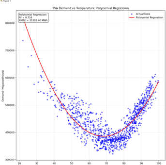
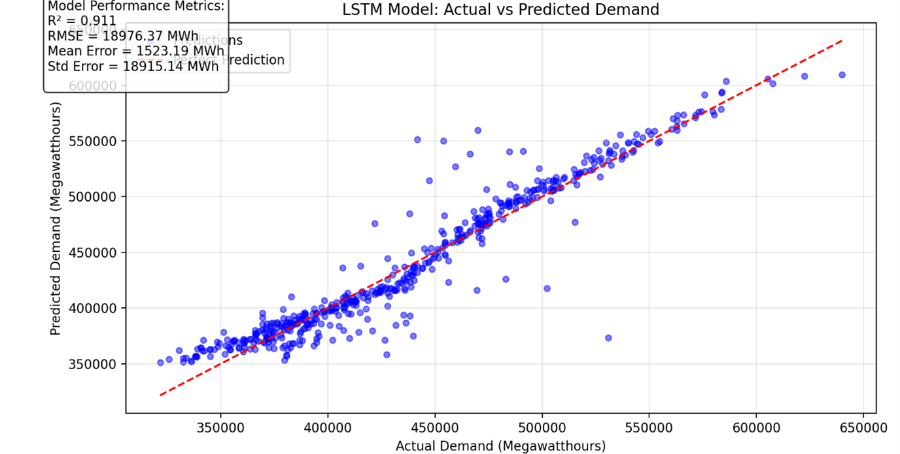
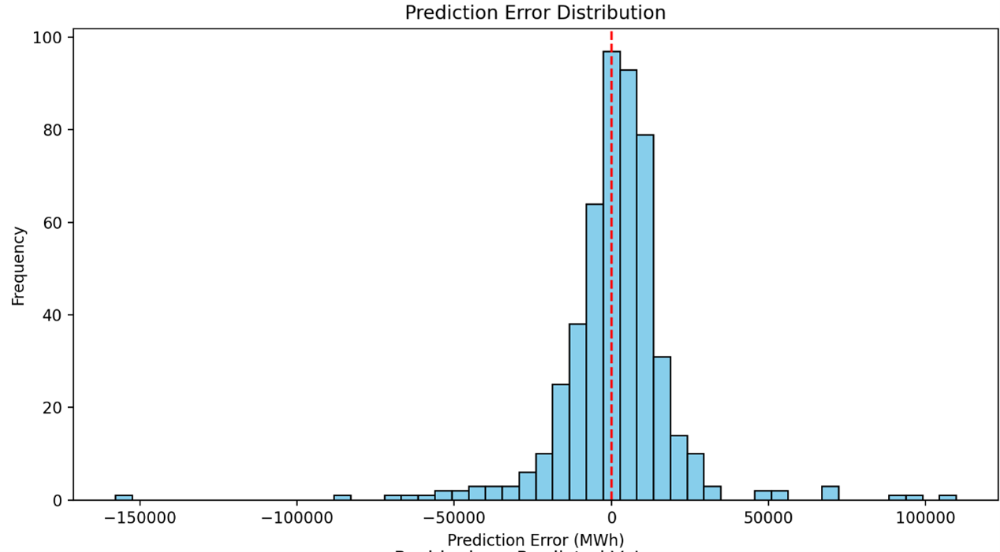
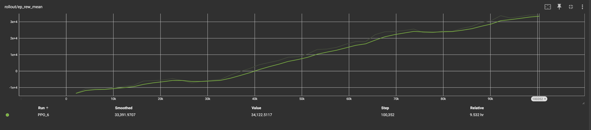

# Electricity Demand Prediction & Grid Optimization

## Research Background & Motivation
This project analyzes the relationship between temperature variations and electricity demand across the TVA service area using data from 2021-2024. The study integrates demand data from the US Energy Information Administration with weather data from major airports across the TVA region.

### Scope
 - The project focuses on electrical data from the Tennessee Valley Authority (TVA), analyzing electricity sourcing and demand measured in Mega Watts per hour (MWh). Weather data from key areas across TVA's service region (TN, AL, MS, KY, & NC). 
### Key Challenges
- **Grid Infrastructure Vulnerabilities**: TVA infrastructure is optimized for hot summers, making it susceptible to extreme cold events.
- **Reactive Grid Management**: Existing methods fail to proactively adapt to changing demand patterns.
- **Computational Inefficiencies**: Static models struggle with large-scale grid optimization.

### The Solution
1. **LSTM Demand Prediction**: Forecasts electricity demand using advanced time-series modeling.
2. **Reinforcement Learning Optimization**: Dynamically manages grid resource allocation to ensure stability during peak demand events.

---

## Baseline Regression Model
### **Temperature Impact on TVA Electricity Demand**
- Analyzed temperature-demand correlation from 2021-2024.
- Used polynomial regression.
- Achieved an **R² score of 0.716**.

---

## LSTM Demand Prediction Model
 - The introduction to use a LSTM-based model was done to address a potential flaw with regrssion ignoring the temporal aspect. 
### **Feature Engineering**
- Temporal Features: Rolling means, demand lags, cyclical patterns.
- Demand Features: Weekly mean, change rate, forecast deviation.
- Temperature Features: Volatility, extreme temp flags, interaction terms.

### **Architecture**
- Bidirectional LSTM layers (128 & 64 units).
- Multi-head attention (8 heads, 32 key dim).
- Dropout (0.2-0.3) & L2 regularization (0.02).
- Custom loss function: **1.9x penalty for under-prediction, 1.5x for over-prediction**.

### **Performance**
- **R² Score: 0.911**
- **RMSE: 18,976 MWh**
- Outperformed TVA’s day-ahead forecast **70.08% of the time**.

#### **Results**

---

## Deep Reinforcement Learning (DRL) for Grid Optimization
A reinforcement learning environment is designed using **Gymnasium** to optimize power allocation.

### **Approach**
- **State Space**: Generator outputs, transformer tap positions, load demands.
- **Action Space**: Adjust generator output, transformer taps, and load shedding.
- **Reward Function**: 
  - Penalizes grid instability, high costs, and load shedding.
  - Rewards balancing supply & demand with minimal violations.

### **Training Performance**
- Mean reward improves over time, stabilizing after fine-tuning.

---

## Conclusion
- **LSTM model** significantly improves electricity demand prediction.
- **DRL model** introduces an adaptive, proactive grid management system.
- Future work includes **weather event classification** and **further RL fine-tuning**.
