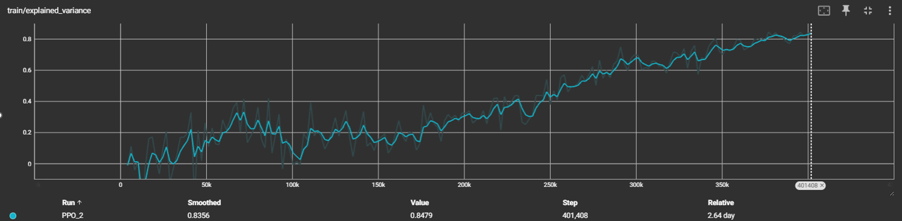

# Electricity Demand Prediction & Grid Optimization

## Research Background & Motivation
This project analyzes the relationship between temperature variations and electricity demand across the TVA service area using data from 2021-2024. The study integrates demand data from the US Energy Information Administration with weather data from major airports across the TVA region.

### Scope
 - The project focuses on electrical data from the Tennessee Valley Authority (TVA), analyzing electricity sourcing and demand measured in Mega Watts per hour (MWh). Weather data from key areas across TVA's service region (TN, AL, MS, KY, & NC). 
### Key Challenges
- **Grid Infrastructure Vulnerabilities**: TVA infrastructure is optimized for hot summers, making it susceptible to extreme cold events.
- **Reactive Grid Management**: Existing methods fail to proactively adapt to changing demand patterns.
- **Computational Inefficiencies**: Static models struggle with large-scale grid optimization.

### The Solution
1. **LSTM Demand Prediction**: Forecasts electricity demand using advanced time-series modeling.
2. **Reinforcement Learning Optimization**: Dynamically manages grid resource allocation to ensure stability during peak demand events.

---

## Baseline Regression Model
### **Temperature Impact on TVA Electricity Demand**
- Analyzed temperature-demand correlation from 2021-2024.
- Used polynomial regression.
- Achieved an **R² score of 0.716**.

---

## LSTM Model

- **Architecture:**  
  2-layer bidirectional LSTM + attention, followed by global pooling and dense layers.

- **Key Features:**  
  - Rolling temperature windows, demand lags  
  - Weekly mean demand, change rate  
  - Temp volatility, extreme flags

- **Metrics:**  
  | Metric        | Value              |
  |---------------|--------------------|
  | R²            | 0.911              |
  | RMSE          | 19,565 MWh         |
  | Mean Error    | 713 MWh (overbias) |
  | Beats TVA Forecast | 70.08% of days |
 
---

## PPO DRL Agent

- **Environment:**  
  PyPSA-based Lauderdale County grid  
  - 6 generators (Nuclear, Hydro, CCGT)  
  - Load centers with realistic demand shares  
  - Thermal constraints, ramp limits, marginal costs

- **Action Space:**  
  - Generator control  
  - Transformer tap shift  
  - Load shedding (up to 20%)

- **Reward Design:**  
  - Balance demand/supply, low thermal overload  
  - Penalize instability, overloads, excessive cost

- **Training:**  
  - Algorithm: PPO (SB3)  
  - Timesteps: 400,000  
  - VecNormalize, 5 eval episodes per 2048 steps

- **Metrics:**  
  | Metric             | Value     |
  |--------------------|-----------|
  | Mean Reward        | ~1480     |
  | Explained Variance | Up to 0.85 |
  | Blackout Risk      | < 5%      |
  | Load Shedding      | < 3% avg  |

---

## Conclusion
- **LSTM model** significantly improves electricity demand prediction.
- **DRL model** introduces an adaptive, proactive grid management system.
- Future work includes **weather event classification** and **further RL fine-tuning**.
